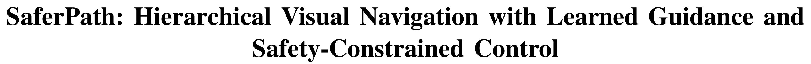
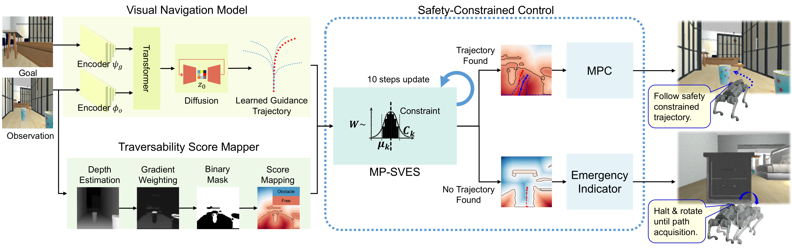

# 
---



---


## Environment Requirements:

Ubuntu 22.04 (for ROS2 Humble), Python 3.10, and a GPU with CUDA 10+. It is recommended to create a virtual environment (e.g., using Conda) for running the codebase. 

---

## Clone the Repository

```bash
git clone https://github.com/zzzzzzlj/SaferPath.git
cd SaferPath
```


---

## Deployment

### Preparation

1. ROS2 Humble Installation

    This project requires ROS2 Humble. Please follow the official installation guide for your platform:
    [ROS2 Humble](https://docs.ros.org/en/humble/index.html)

2. Install Dependencies

    ```bash
    pip install -r requirements.txt
    ```

3. External Dependencies

    SaferPath relies on some external open-source projects.  
    Please clone the following repositories before running our code:

    ```bash
    # Clone Depth-Anything-V2 and rename the folder
    git clone https://github.com/DepthAnything/Depth-Anything-V2.git
    mv Depth-Anything-V2 Depth_Anything_V2  # Rename folder to avoid issues with hyphens


    # Clone diffusion_policy
    git clone git@github.com:real-stanford/diffusion_policy.git
    ```

    After cloning the repositories, make sure your project directory looks like this:

    ```
    ├── SaferPath
    │   ├──deployment/
    │   ├──Depth_Anything_V2/
    │   ├──diffusion_policy/
    │   ├──train/
    │   ├──...
    ```

4. Download checkpoints

    Download [Depthanything V2 pre-trained models](https://github.com/DepthAnything/Depth-Anything-V2/tree/main) and put the checkpoint files in `Depth_Anything_V2/checkpoints`, the small version is sufficient.

5. After [training](#train), put your model in `deployment/model_weights`

### Record a topomap for navigation
1. Launch your robot or simulation platform, and modify the corresponding ROS2 topics in `deployment/saferpath/config_navigation.py` according to your robot. Also you need to set your camera parameters in `/train/vint_train/data/data_config.yaml` (Here are some examples in this file).

2. Launch your robot or simulation platform. Manually drive the robot along a path that you want to use for navigation. While moving, run the following command in a terminal (replace <camera_topic> with your actual camera topic, e.g., /camera/image_raw):
    ```
    cd deployment/topomaps/bags # create it if the folder doesn't exist.
    ros2 bag record -o <topomap_bag> <camera_topic>
    ```

    <topomap_bag> → specifies the output bag name, use whatever you want.

    <camera_topic> → the topic publishing your camera images.

    Press Ctrl+C to stop recording after completing the path.

3. Make the topologic map: 
   
   Disconnect ROS2 from the robot after finishing the recording.

   Open a terminal and run:
    ```
    cd deployment/src
    python create_topomap_ros2.py --dir <topomap_images> --dt 1
    ```

    <topomap_images> → folder to save the topomap images.

    --dt 1 → sampling interval between frames (adjust if needed).

    Open another terminal and run:
    ```
    cd deployment/topomaps/bags
    ros2 bag play <topomap_bag>
    ```
    <topomap_bag> → the ROS2 bag you recorded earlier.

4. Make sure that the corresponding topomap folder you just created exists under `deployment/topomaps/images`, and that the images inside are named sequentially as 0.png, 1.png....

### Navigation

1. Start the navigation node:
   
    Open a terminal and run:

    ```
    python navigation_main.py -m <model> -d <topomap>
    ```
    
    <model> → the chosen end-to-end visual navigation model.

    <topomap> → the topomap folder you created earlier.

2. Start the controller node
   
    Open another terminal and run:

    ```
    python controller_main.py
    ```

---

## Train 

SaferPath uses one of GNM, ViNT, or NoMaD as the base end-to-end visual navigation model. You can either train your own model following the instructions or download the pre-trained model from [this link](https://github.com/robodhruv/visualnav-transformer/tree/main). 

This subfolder `train` contains code for processing datasets and training models from your own data.


### Setup
Run the commands below inside the `vint_release/` (topmost) directory:
1. Set up the conda environment:
    ```bash
    conda env create -f train/train_environment.yml
    ```
2. Source the conda environment:
    ```
    conda activate vint_train
    ```
3. Install the vint_train packages:
    ```bash
    pip install -e train/
    ```
4. Install the `diffusion_policy` package from this [repo](https://github.com/real-stanford/diffusion_policy):
    ```bash
    pip install -e diffusion_policy/
    ```


### Data-Wrangling
You can use various open-source datasets. The following datasets have been tested and are suitable for training:
- [RECON](https://sites.google.com/view/recon-robot/dataset)
- [TartanDrive](https://github.com/castacks/tartan_drive)
- [SCAND](https://www.cs.utexas.edu/~xiao/SCAND/SCAND.html#Links)
- [GoStanford2 (Modified)](https://drive.google.com/drive/folders/1RYseCpbtHEFOsmSX2uqNY_kvSxwZLVP_?usp=sharing)
- [SACSoN/HuRoN](https://sites.google.com/view/sacson-review/huron-dataset)

We recommend you to download these (and any other datasets you may want to train on) and run the processing steps below.

#### Data Processing 

We provide some sample scripts to process these datasets, either directly from a rosbag or from a custom format like HDF5s:
1. Run `process_bags.py` with the relevant args, or `process_recon.py` for processing RECON HDF5s. You can also manually add your own dataset by following our structure below (if you are adding a custom dataset, please checkout the [Custom Datasets](#custom-datasets) section).
2. Run `data_split.py` on your dataset folder with the relevant args.

After step 1 of data processing, the processed dataset should have the following structure:

```
├── <dataset_name>
│   ├── <name_of_traj1>
│   │   ├── 0.jpg
│   │   ├── 1.jpg
│   │   ├── ...
│   │   ├── T_1.jpg
│   │   └── traj_data.pkl
│   ├── <name_of_traj2>
│   │   ├── 0.jpg
│   │   ├── 1.jpg
│   │   ├── ...
│   │   ├── T_2.jpg
│   │   └── traj_data.pkl
│   ...
└── └── <name_of_trajN>
        ├── 0.jpg
        ├── 1.jpg
        ├── ...
        ├── T_N.jpg
        └── traj_data.pkl
```  

Each `*.jpg` file contains an forward-facing RGB observation from the robot, and they are temporally labeled. The `traj_data.pkl` file is the odometry data for the trajectory. It’s a pickled dictionary with the keys:
- `"position"`: An np.ndarray [T, 2] of the xy-coordinates of the robot at each image observation.
- `"yaw"`: An np.ndarray [T,] of the yaws of the robot at each image observation.


After step 2 of data processing, the processed data-split should the following structure inside `vint_release/train/vint_train/data/data_splits/`:

```
├── <dataset_name>
│   ├── train
|   |   └── traj_names.txt
└── └── test
        └── traj_names.txt 
``` 

### Training your General Navigation Models
Run this inside the `vint_release/train` directory:
```bash
python train.py -c <path_of_train_config_file>
```
The premade config yaml files are in the `train/config` directory. 


# Acknowledgment
SaferPath is inspired by [ViNT/NoMaD](https://github.com/robodhruv/visualnav-transformer/tree/main) and [DepthAnything](https://github.com/DepthAnything/Depth-Anything-V2/tree/main). We thank the authors for sharing their excellent work.